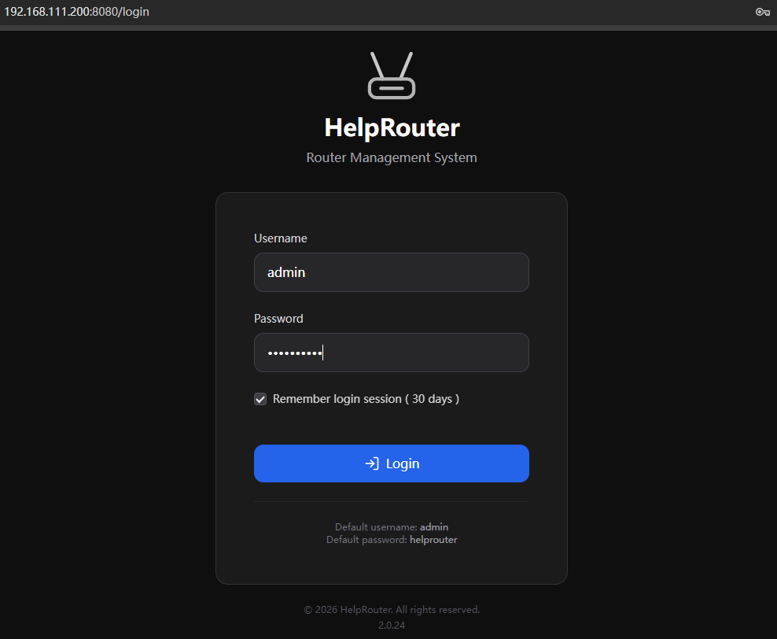
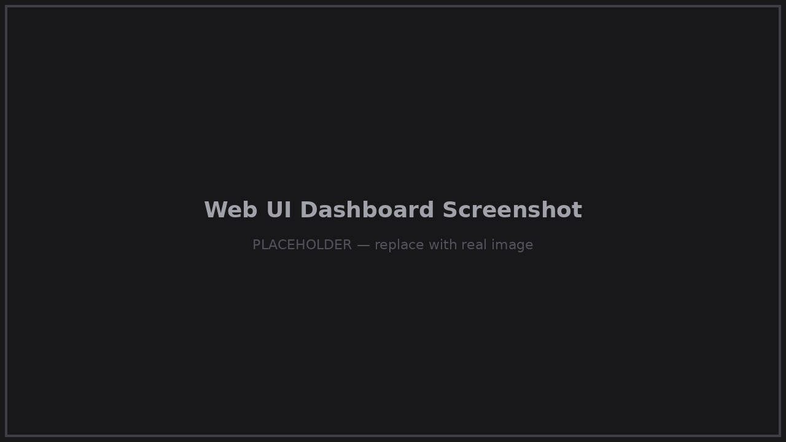

  

<h1 align="center">HelpRouter</h1>

  <b>Turn any network into your private network.</b> 
  A Raspberry Pi 5 based portable private router, powered by <b>HelpOS Router Edition</b>.

  
  
  

---

## What is HelpRouter?

HelpRouter is a pocket-sized device you build yourself: flash the free **HelpOS Router Edition** image
to a Raspberry Pi 5, power it on, and you own a full-featured personal router that travels with you.

Wherever you are — a hotel, an Airbnb, a co-working space, a rented apartment — HelpRouter connects
to the upstream network, then broadcasts **your own dual-band WiFi** with fixed IPs that never change.
Your devices, your services, and your workflow stay exactly the same, no matter whose network you're on.

**One device. Three roles:**

1. **WiFi Repeater** — connect to any upstream WiFi (or wired Ethernet)
2. **Dual-Band Hotspot** — your own 2.4G + 5G private network with fixed IPs
3. **Multi-Service Server** — SSH, SMB, FTP, Git, SVN, DNS, Web and File server, running simultaneously

  

  

## Features

| | |
|---|---|
| **Network** | WiFi repeater, dual-band (2.4G + 5G) hotspot, fixed-IP DHCP, MAC clone |
| **Remote Access** | Free `yourname.hc.ink` subdomain, DDNS + tunnel, works behind NAT/CGNAT, no port forwarding |
| **Security** | DNS-level ad blocking, malware/phishing protection, adult content filtering, VPN server & client (WireGuard / OpenVPN) |
| **Built-in Services** | SSH · SMB · FTP · Git · SVN · DNS · Web · File server — all pre-installed, toggle from the web UI |
| **Local Share** | Browser-based text & file sharing between all devices on your network — no app, no cloud |
| **Management** | Full web UI, built-in web terminal, one-click upgrade, backup & restore |
| **Ownership** | Runs entirely on your hardware. No cloud dependency, no telemetry, no accounts, full SSH access |

## Quick Start

1. **Get the hardware** — see the [Hardware List](docs/hardware.md) (Raspberry Pi 5 + off-the-shelf parts)
2. **Download** the latest HelpOS Router Edition image from [helprouter.com](https://helprouter.com/products) or [Releases](https://github.com/chenjindu/HelpRouter/releases)
3. **Flash** it to a microSD card or SSD — see the [Flash Guide](docs/flash-guide.md)
4. **Power on**, connect to the `HelpRouter-5G-xxxx` or `HelpRouter-2.4G-xxxx` WiFi hotspot (default password: `helprouter`)
5. Open **http://192.168.111.200:8080** and log in with `admin` / `helprouter`

From download to a working router in about ten minutes.

## Documentation

- [Architecture](docs/architecture.md) — network topology and system design
- [Hardware List](docs/hardware.md) — full bill of materials with model numbers
- [Flash Guide](docs/flash-guide.md) — writing the image and first boot
- [Configuration](docs/configuration.md) — WAN, hotspot, DNS filtering, VPN, remote access, services

Product tour with screenshots: [helprouter.com/tour](https://helprouter.com/tour)

## Community & Support

- **Questions / discussion** → [GitHub Discussions](https://github.com/chenjindu/HelpRouter/discussions) — English, 中文, 日本語 all welcome
- **Bug reports** → [GitHub Issues](https://github.com/chenjindu/HelpRouter/issues/new/choose)
- **Website** → [helprouter.com](https://helprouter.com)

## HelpOS

HelpOS is the operating system that powers HelpRouter — based on Raspberry Pi OS Lite, with all
services pre-installed and pre-configured. **HelpOS Router Edition** is the first member of a
planned family of pre-configured, single-purpose editions.

## License & Distribution

- The **documentation** in this repository is licensed under the [MIT License](LICENSE).
- The **HelpOS image** is distributed free of charge for personal and commercial use, as a binary
  image. The HelpOS source code is not published; this repository is the official distribution
  and documentation home of the product.
- The image is built on Raspberry Pi OS Lite and includes open-source components, each governed
  by its own license.

---

*A personal infrastructure project by [Jindu Chen](https://github.com/chenjindu), shared with the world.*
