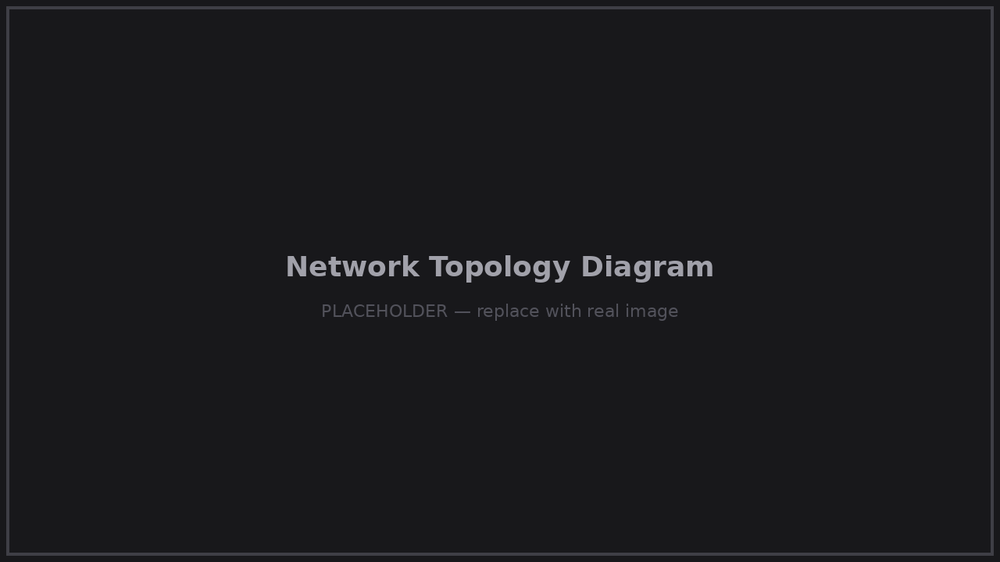

# Architecture

How HelpRouter sits in your network, and how HelpOS is put together.

## Network Topology

HelpRouter sits between the untrusted upstream network and your own devices.
Upstream can be any WiFi (hotel, Airbnb, office, landlord) or a wired Ethernet connection —
your side of the network never changes.

<p align="center">
  
</p>

```
                      ┌──────────────────────────────────────────────┐
                      │                 HelpRouter                   │
   Upstream WiFi ────►│  WiFi radio #1 (upstream / repeater)         │
        or            │                                              │
   Wired Ethernet ───►│  Gigabit Ethernet (upstream, optional)       │
                      │                                              │
                      │  WiFi radio #2 ── 2.4 GHz hotspot ──┐        │
                      │  WiFi radio #3 ── 5 GHz hotspot ────┤        │
                      └─────────────────────────────────────┼────────┘
                                                            │
                              Your private network (fixed IPs, 192.168.8.0/24)
                                                            │
                    ┌───────────┬───────────┬───────────────┤
                 Laptop      Phone       Tablet      Other devices
```

Key properties:

- **Your devices always get the same IP** — DHCP fixed-IP assignments survive reboots and relocations.
- **NAT isolation** — the upstream network only ever sees one device (HelpRouter). With MAC clone,
  even networks with single-device restrictions work.
- **Everything keeps working offline** — LAN services (SMB, Git, Local Share, DNS…) don't need
  the upstream at all.

## Software Stack

HelpOS Router Edition is based on **Raspberry Pi OS Lite** (Debian, arm64) with all services
pre-installed and pre-wired:

```
┌─────────────────────────────────────────────────────┐
│  Web UI  ·  Web Terminal  ·  Setup Wizard           │  ← http://192.168.8.1
├─────────────────────────────────────────────────────┤
│  Services layer                                     │
│  SSH · SMB · FTP · Git · SVN · Web · File · Share   │
├─────────────────────────────────────────────────────┤
│  Network layer                                      │
│  WAN (WiFi repeater / Ethernet / MAC clone)         │
│  Hotspot (2.4G + 5G AP), DHCP with fixed IPs        │
│  DNS server with filtering (ads / malware / adult)  │
│  VPN server & client (WireGuard, OpenVPN)           │
│  Remote access (DDNS + tunnel, *.hc.ink)            │
├─────────────────────────────────────────────────────┤
│  HelpOS base (Raspberry Pi OS Lite, arm64)          │
│  Watchdogs: WiFi reconnection, USB adapter recovery │
└─────────────────────────────────────────────────────┘
```

Notes:

- **Full SSH access** to the underlying Linux system is included — it's your device.
- Built-in **watchdogs** recover automatically from upstream WiFi drops and USB WiFi adapter
  failures, so the router keeps itself alive unattended.
- Management is entirely web-based; the terminal is one click away when you want it.

## Radio Layout

| Radio | Hardware | Role |
|---|---|---|
| #1 | USB 3.0 adapter (ALFA AWUS036AXML) | Upstream — connects to the source WiFi |
| #2 | M.2 card (MT7922) via PCIe HAT | 2.4 GHz hotspot |
| #3 | M.2 card (MT7922) via PCIe HAT | 5 GHz hotspot |

With this layout the repeater and the dual-band hotspot run **simultaneously** —
no bandwidth halving, no mode switching. See the [Hardware List](hardware.md) for exact parts.

## Remote Access Path

```
Your phone (anywhere) ──► yourname.hc.ink ──► DDNS / tunnel ──► HelpRouter ──► your LAN
```

- With a public IP upstream, DDNS points your subdomain straight at the router.
- Behind NAT / CGNAT, the built-in tunnel service keeps the router reachable anyway.
- Either way: no port forwarding, no router configuration on the upstream side.
