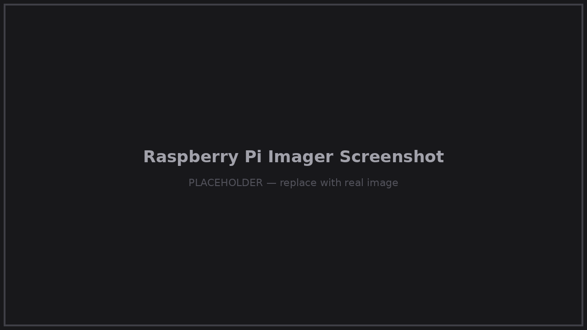
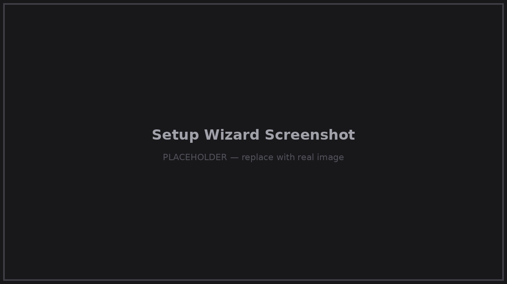

# Flash Guide

From a downloaded image to a booted router. About ten minutes, no Linux knowledge required.

## 1. Download the image

Get the latest **HelpOS Router Edition** image (`.img.xz`) from:

- [helprouter.com/products](https://helprouter.com/products) (recommended), or
- [GitHub Releases](https://github.com/chenjindu/HelpRouter/releases)

## 2. Verify the checksum

Every release publishes a SHA256 checksum. Verify it before flashing —
it rules out corrupted downloads, which are the #1 cause of "it doesn't boot".

**Windows (PowerShell):**
```powershell
Get-FileHash .\helpos-x.y.z-pi5.img.xz -Algorithm SHA256
```

**macOS / Linux:**
```bash
shasum -a 256 helpos-x.y.z-pi5.img.xz
```

Compare the output with the checksum shown next to the download. They must match exactly.

## 3. Flash to microSD / SSD

Use either tool — both accept `.img.xz` directly, no need to decompress:

**Raspberry Pi Imager** (recommended)

1. Install from [raspberrypi.com/software](https://www.raspberrypi.com/software/)
2. *Choose Device* → Raspberry Pi 5
3. *Choose OS* → *Use custom* → select the downloaded `.img.xz`
4. *Choose Storage* → your microSD card or USB-attached SSD
5. When asked about OS customisation, choose **No** — HelpOS ships pre-configured
6. Write and wait for verification to finish

**balenaEtcher**

1. Install from [etcher.balena.io](https://etcher.balena.io/)
2. *Flash from file* → select the `.img.xz` → select the target drive → *Flash!*

<p align="center">
  
</p>

> ⚠️ Flashing erases everything on the target card/drive. Double-check you selected the right one.

## 4. First boot

1. Insert the microSD card (or connect the SSD) into the Raspberry Pi 5
2. Connect the 27W USB-C power supply
3. Wait about **one minute** for the first boot to complete

## 5. Connect and configure

1. On your phone or laptop, join the new WiFi network **`HelpRouter`**
   (default password: **`helprouter`**)
2. Open **http://192.168.8.1** in your browser
3. Follow the setup wizard: connect to your upstream WiFi (or plug in Ethernet),
   and set your own hotspot and admin passwords

<p align="center">
  
</p>

That's it — your private network is live. Continue with the
[Configuration guide](configuration.md) for DNS filtering, VPN, remote access and services.

## Troubleshooting

| Symptom | Check |
|---|---|
| No `HelpRouter` WiFi after 2–3 minutes | Re-verify the SHA256; re-flash; confirm the PSU is 27W (under-powered Pi 5s fail silently) |
| Flashed fine but no boot (no green LED activity) | Try another microSD card — worn cards flash OK but fail to boot |
| Hotspot appears but 192.168.8.1 won't open | Make sure you're connected to `HelpRouter`, not your old WiFi; try `http://` explicitly (not `https://`) |
| Anything else | Ask in [Discussions](https://github.com/chenjindu/HelpRouter/discussions) or file an [Issue](https://github.com/chenjindu/HelpRouter/issues/new/choose) |
