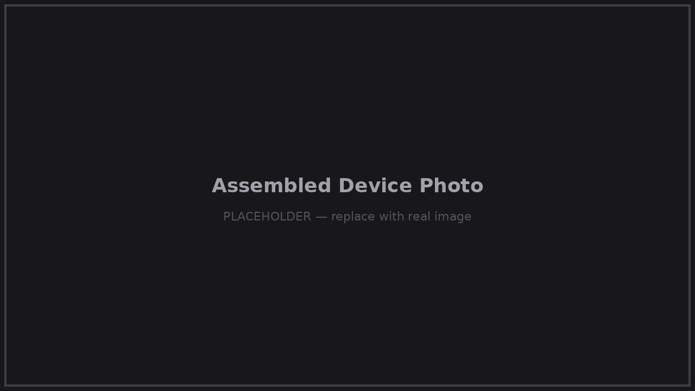
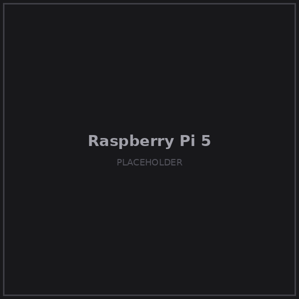
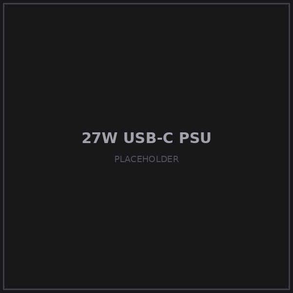
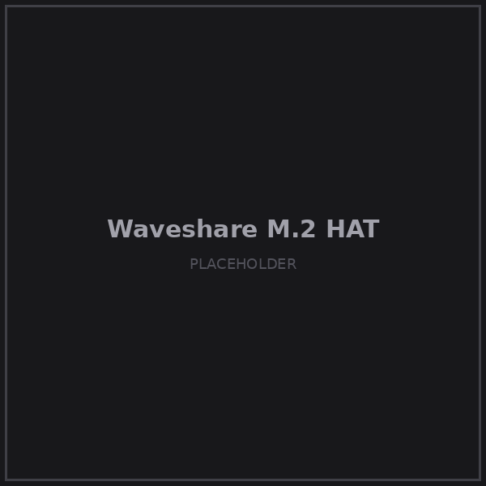
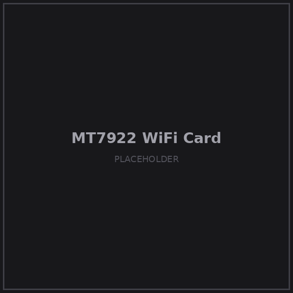
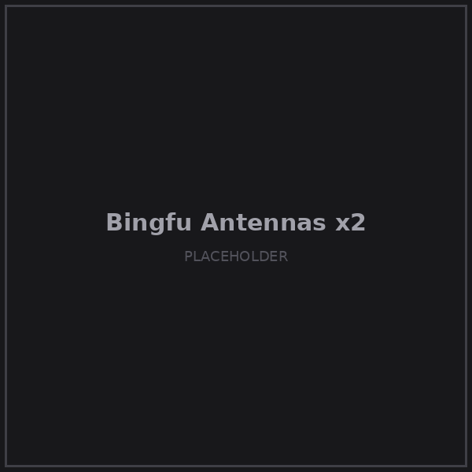

# Hardware List (BOM)

The complete parts list. All items are off-the-shelf and available worldwide
(Amazon links on [helprouter.com/products](https://helprouter.com/products)).
Equivalent parts with the same specs also work — these are the exact models we build and test with.

  

| # | Photo | Part | Notes |
|---|-------|------|-------|
| 1 |  | **Raspberry Pi 5** | 4GB RAM or more (8GB recommended) |
| 2 |  | **microSD card or USB SSD** | 16 GB or larger; SSD gives better longevity under 24/7 use |
| 3 |  | **27W USB-C power supply** | Official Raspberry Pi 27W PSU recommended — the Pi 5 is picky about power |
| 4 |  | **Waveshare PCIe to M.2 E-Key HAT** | For Raspberry Pi 5; supports NGFF (M.2 E-Key) wireless NICs, USB Bluetooth; HAT+ standard |
| 5 |  | **MT7922 Wi-Fi 6E network card** | M.2 E-Key; drives the 2.4G + 5G dual-band hotspot |
| 6 |  | **ALFA NETWORK AWUS036AXML** | 802.11axe WiFi 6E USB 3.0 adapter (AXE3000, tri-band); the upstream/repeater radio |
| 7 |  | **Bingfu dual-band antennas (2-pack)** | 2.4/5/5.8 GHz 3dBi MIMO, RP-SMA male; connect to the MT7922 |
| 8 |  | **GeeekPi aluminum case for Pi 5** | With active cooler; supports PCIe peripheral boards (X1000/X1001/X1003/N04/N05) |

## Assembly Notes

1. Mount the **active cooler** on the Pi 5 first, then the **PCIe HAT** on top.
2. Insert the **MT7922** card into the HAT's M.2 slot and connect its two antenna
   pigtails; screw the **Bingfu antennas** onto the RP-SMA connectors through the case.
3. Plug the **ALFA adapter** into one of the **blue USB 3.0 ports** (USB 2.0 ports will
   throttle it badly).
4. Insert the flashed microSD / connect the SSD, close the case, connect power. Done.

  

## Minimal Build (reduced feature set)

No PCIe HAT / MT7922 / ALFA at hand? HelpOS also runs on a **bare Raspberry Pi 5** using the
onboard WiFi. You still get the hotspot, all services, DNS filtering, VPN and remote access —
but the onboard radio can't repeat upstream WiFi and broadcast dual-band at full performance
at the same time. Use wired Ethernet as the upstream in this setup, or accept reduced
throughput. The full parts list above is what unlocks *simultaneous* repeater + dual-band hotspot.

## Power Consumption

Typical draw is **5–15W** depending on load — comparable to a phone charger.
It runs comfortably from a USB-C power bank that supports PD, which is what makes it
a practical travel companion.
